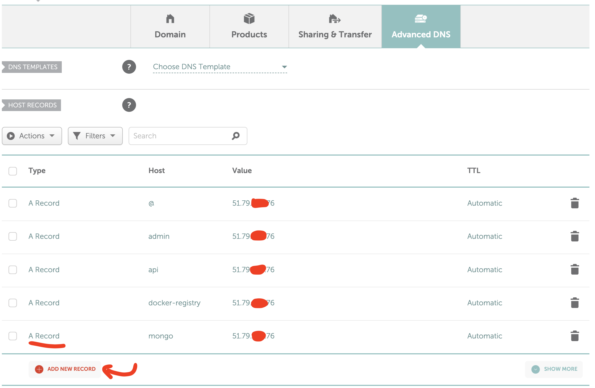

# Setup WebServer guide for dummies

## Requirement

```
OS: >= Debian 10
RAM: >= 2GB
Storage: >= 40GB
```

Why Debian?

- It Linux distro. It's free, lightweight enough.
- It's just a matter of choice.
- Nothing more.

Why 2GB RAM? It's even less memory than my stupid phone.
- It's enough to run a lot of things, and enough to build things too. Remember? With 4KB of RAM, people can send someone to the moon.

Why 40GB storage? It's less storage than my stupid phone.
- Yes. But it's the minimum storage option for almost VPS service provider nowadays. With this, we can install applications, install another stuff, and the database too.

WIth these requirements, you may need to pay about $6 - 8$/month for purchasing the service. You can use it for learning purpose or even for production too.

## Setup

### Connecting to the server

After setting up the server, you can connect to it using SSH (Secure Shell).

Don't scare about it. Just using `ssh {username}@{ip_of_your_server}` then enter the password and done. <br/> Now you have access to remote terminal, using it just like the one (Terminal or Cmd prompt) in your machine.

*{username} & {ip_of_your_server} will be provided by VPS provider. Usually via an email which you used to rent the VPS.*
 


### Setup Nginx web server

Why Nginx (engine-x)?

These are a few web server application (Apache, IIS, ..., Nginx). The last one is trending right now. So we'll use it. 

Run cmd below to install Nginx (ref: [Install Nginx on debian 10](https://www.digitalocean.com/community/tutorials/how-to-install-nginx-on-debian-10))
```
sudo apt install nginx
```

You may need to run the cmdline with `sudo` if the VPS provider doesn't give you the root account.

### Setup Certbot to generate SSL, TLS certificate automatically and FREE

Why SSL, TLS certificates?

For better secure for our users. Everyone loves https nowadays, so why not?

Run cmd below to install certbot (ref: [Setup cerbot](https://haydenjames.io/how-to-set-up-an-nginx-certbot/)).
```
sudo add-apt-repository ppa:certbot/certbot
sudo apt update
```
Troubleshoot:

If `add-apt-repository` not found, run cmd below to fix (ref: [Fix add-apt-repository command not found](https://phoenixnap.com/kb/add-apt-repository-command-not-found-ubuntu)). 
```
sudo apt install software-properties-common
sudo apt update
```

If the error below show up
```
add-apt-repository ppa:certbot/certbot
 The PPA has been DEPRECATED.

To get up to date instructions on how to get certbot for your systems, please see https://certbot.eff.org/docs/install.html.
 More info: https://launchpad.net/~certbot/+archive/ubuntu/certbot
Press [ENTER] to continue or ctrl-c to cancel adding it

Exception in thread Thread-1:
Traceback (most recent call last):
  File "/usr/lib/python3.7/threading.py", line 917, in _bootstrap_inner
    self.run()
  File "/usr/lib/python3.7/threading.py", line 865, in run
    self._target(*self._args, **self._kwargs)
  File "/usr/lib/python3/dist-packages/softwareproperties/SoftwareProperties.py", line 688, in addkey_func
    func(**kwargs)
  File "/usr/lib/python3/dist-packages/softwareproperties/ppa.py", line 386, in add_key
    return apsk.add_ppa_signing_key()
  File "/usr/lib/python3/dist-packages/softwareproperties/ppa.py", line 252, in add_ppa_signing_key
    tmp_keyring, tmp_secret_keyring, signing_key_fingerprint, tmp_keyring_dir):
  File "/usr/lib/python3/dist-packages/softwareproperties/ppa.py", line 181, in _recv_key
    "--recv", signing_key_fingerprint,
  File "/usr/lib/python3.7/subprocess.py", line 323, in call
    with Popen(*popenargs, **kwargs) as p:
  File "/usr/lib/python3.7/subprocess.py", line 775, in __init__
    restore_signals, start_new_session)
  File "/usr/lib/python3.7/subprocess.py", line 1522, in _execute_child
    raise child_exception_type(errno_num, err_msg, err_filename)
FileNotFoundError: [Errno 2] No such file or directory: 'gpg': 'gpg'
```

then run command line below to inspect 
```
lsb_release -cs
grep ^ /etc/apt/sources.list /etc/apt/sources.list.d/*
```

The result:
```
buster

/etc/apt/sources.list.d/certbot-ubuntu-certbot-kinetic.list:deb http://ppa.launchpad.net/certbot/certbot/ubuntu kinetic main
/etc/apt/sources.list.d/certbot-ubuntu-certbot-kinetic.list:# deb-src http://ppa.launchpad.net/certbot/certbot/ubuntu kinetic main
/etc/apt/sources.list.d/certbot-ubuntu-certbot-kinetic.list:# deb-src http://ppa.launchpad.net/certbot/certbot/ubuntu kinetic main
/etc/apt/sources.list.d/certbot-ubuntu-certbot-kinetic.list:# deb-src http://ppa.launchpad.net/certbot/certbot/ubuntu kinetic main
/etc/apt/sources.list.d/certbot-ubuntu-certbot-kinetic.list.save:deb http://ppa.launchpad.net/certbot/certbot/ubuntu kinetic main
/etc/apt/sources.list.d/certbot-ubuntu-certbot-kinetic.list.save:# deb-src http://ppa.launchpad.net/certbot/certbot/ubuntu kinetic main
/etc/apt/sources.list.d/certbot-ubuntu-certbot-kinetic.list.save:# deb-src http://ppa.launchpad.net/certbot/certbot/ubuntu kinetic main
```
The different is `buster` -> `kinetic`. Follow step below to fix it.

### Setup Certbot Nginx plugin
Now we already have Nginx and certbot up and running. To generate SSL/TLS, we need to install Certbot plugin for Nginx by run cmd below:
```
sudo apt install python-certbot-nginx
```
Troubleshoot:

In some situations, you may be unable to install **python-certbot-nginx**.<br/>
For example the added ppa url doesn't match with **lsb_release** version of server machine. In this case, you need to check and correct it manually.<br/>
E.g:
1. Debian 11 has lsb_release is **bullseye** and Debian 10 have lsb_release is **buster**. (Run cmd `lsb_release -cs` to get this value)
2. Check supported plugins ([For example Nginx Certbot plugin for Debian 11](https://debian.pkgs.org/10/debian-main-arm64/python3-certbot-nginx_1.10.1-1_all.deb.html))
3. You can run this cmd to get a list of installed repositories: `grep ^ /etc/apt/sources.list /etc/apt/sources.list.d/*`. For example:
   ```
   /etc/apt/sources.list.d/certbot-ubuntu-certbot-jammy.list:# deb-src http://ppa.launchpad.net/certbot/certbot/ubuntu jammy main
   /etc/apt/sources.list.d/certbot-ubuntu-certbot-jammy.list.save:# deb-src http://ppa.launchpad.net/certbot/certbot/ubuntu jammy main
   ```
   In this case, the lsb_release in added ppa is **jammy**. It's incorrect, so you need to open the file */etc/apt/sources.list.d/certbot-ubuntu-certbot-jammy.list*, change `deb-src http://ppa.launchpad.net/certbot/certbot/ubuntu jammy main` to `deb-src http://ppa.launchpad.net/certbot/certbot/ubuntu buster main`, and rename the file to `/etc/apt/sources.list.d/certbot-ubuntu-certbot-buster.list`. Do the same for the other file.

Now we have a server, Nginx & Certbot installed. It's the time to buy a domain name.

### Buying a domain name

It's very easy to buy a domain, you can choose any domain name providers out there (AWS Route 53, Namecheap, GoDaddy ..., you name it).

There are some features you need to care when choosing domain name provider:
- Whether it support payment via Paypal, Square, Stripe, ... (in case you have some issues with Credit, Debit card)
- Whether this service allow you to sub-domain.
- Whether set up sub-domain easily.
- Support robust routing mechanisms (base on geography, weighted,...)
- Have support center

Recommended:
- [GoDaddy](https://godaddy.com)
- [Namecheap](https://www.namecheap.com/)
- [Aws Route 53](https://aws.amazon.com/vi/route53/)
- You name it

### Setup domain, sub-domain
It's quite simply, you just need to point your domain name to the server machine public IP address and done.

In this example below, I create a imagine domain name `my-site.com` and sub-domain `admin.my-site.com`, `api.my-site.com`, `docker-registry.my-site.com`, `mongo.my-site.com` and point all domain to my VPS with public ip address is `51.79.xxx.76`.


Now if you access these domains, I bet you'll see Nginx Welcome page (in your imagination). Just leave it for now, we'll touch it later after complete setting up our applications.

### Setup Docker

Why Docker? WTF! Why people never stop talking about it nowadays. Do we actually need it?

Absolutely not.<br/>
We don't need Docker to run things<br/>
and we don't need DNS to resolve our domains<br/>
and we don't event need web servers (Nginx, Apache, IIS) to mapping a domain to specified service in our service<br/>
and we don't even need a domain name at all<br/>
...<br/>
just public IP address and port is enough.

But without this stuff, internet is sucks and using it will be very difficult.<br/>
That why people create thing to make it better.

Virtual Machine, Docker, Docker Swarm, Kubernetes, Jenkins, Circle CI, ... all of these stuff help the deployment process smoothly, easier. That why we all spent time to learn it. 

Docker help you run your apps in containerized environment which is separated from your server machine, but can sharing the same resources (RAM, shared storage).

To install Docker for debian, run cmd below (ref: [Install docker for Debian in detail](https://docs.docker.com/engine/install/debian/)):
```
curl -fsSL https://download.docker.com/linux/debian/gpg | sudo gpg --dearmor -o /usr/share/keyrings/docker-archive-keyring.gpg

sudo apt-get update

sudo apt-get install \
    ca-certificates \
    curl \
    gnupg \
    lsb-release

echo \
  "deb [arch=$(dpkg --print-architecture) signed-by=/usr/share/keyrings/docker-archive-keyring.gpg] https://download.docker.com/linux/debian \
  $(lsb_release -cs) stable" | sudo tee /etc/apt/sources.list.d/docker.list > /dev/null

sudo apt-get update

sudo apt-get install docker-ce docker-ce-cli containerd.io
```

### Setup Private Docker Registry

Hosting our private docker registry may be "the best" practice for production. If you want to using public Docker images, skip this section & a section below.

The cmd below will create basic authentication from {username} and {password} and store it in **registry-config/htpasswd** file - which will be used as Docker private registry user. Note that, you must replace {username} and {password} with the account you want to access the private registry.
```
docker pull httpd:2

mkdir registry-config

docker run --entrypoint htpasswd httpd:2 -Bbn {username} {password} > registry-config/htpasswd
```

Example: Create account with username = dev, password = 123456, store generated hash in registry-config/htpasswd file.

```
docker pull httpd:2

mkdir registry-config

docker run --entrypoint htpasswd httpd:2 -Bbn dev 123456 > registry-config/htpasswd
```

Troubleshoot:

If you don't have root access, running this command may be fail because httpd:2 can not access permission to **registry-config/htpasswd** file.
In this case, you just need to run `docker run --entrypoint htpasswd httpd:2 -Bbn {username} {password}`, copy the output to **registry-config/htpasswd** file.


#### Create Docker registry config file (ref: [Example](https://github.com/Joxit/docker-registry-ui/blob/main/examples/ui-as-proxy/registry-config/credentials.yml))
```
vi registry-config/credentials.yml
```

Credentials.yml content:<br/>

*Note that `headers` section is optional. You can remove `headers` section if you only want to work with docker registry via terminal. If you want to use it in web interface (we'll install it later), you must replace {docker-registry-ui-domain-name} with the domain name of UI app. For example: `https://registry.my-site.com`*

```yml
version: 0.1
log:
  fields:
    service: registry
storage:
  delete:
    enabled: true
  cache:
    blobdescriptor: inmemory
  filesystem:
    rootdirectory: /var/lib/registry
http:
  addr: :5000
  headers:
    X-Content-Type-Options: [nosniff]
    Access-Control-Allow-Origin: ['{docker-registry-ui-domain-name}']
    Access-Control-Allow-Methods: ['HEAD', 'GET', 'OPTIONS', 'DELETE']
    Access-Control-Allow-Headers: ['Authorization', 'Accept']
    Access-Control-Max-Age: [1728000]
    Access-Control-Allow-Credentials: [true]
    Access-Control-Expose-Headers: ['Docker-Content-Digest']
auth:
  htpasswd:
    realm: basic-realm
    path: /etc/docker/registry/htpasswd
```

Now the account & setting for Docker private registry has been created. We're going to run it via docker container.
```
docker run -d -p 5000:5000 --restart=always \
  --name registry  \
  -v "$(pwd)"/data:/var/lib/registry \
  -v "$(pwd)"/auth:/auth \
  -v "$(pwd)"/registry-config/credentials.yml:/etc/docker/registry/config.yml \
  -v "$(pwd)"/registry-config/htpasswd:/etc/docker/registry/htpasswd \
  -e REGISTRY_STORAGE_DELETE_ENABLED=true \
registry:2 
```

### Setup Docker Registry UI
To set up Docker registry ui, run cmd below (ref: [docker-registry-ui](https://hub.docker.com/r/joxit/docker-registry-ui)).

Note that you must replace {docker-registry-url} with the url of your docker registry, and {PORT_TO_DOCKER_REGISTRY_UI} to the port you want this service to listen.

```
sudo docker run -d  -p {PORT_TO_DOCKER_REGISTRY_UI}:80 --restart=always \
   --name registry-ui \
   -e DELETE_IMAGES=true \
   -e REGISTRY_TITLE=DockerRegistry \
   -e REGISTRY_URL={docker-registry-url} \
   joxit/docker-registry-ui:latest
```

Example:

Hosting docker-registry container in port 5000, access by `https://registry.my-site.com`. Then hosting docker-registry-ui container in port 5001, access by `https://ui-registry.my-site.com`.

In registry-config/credentials.yml file:
```yml
...
http:
  addr: :5000
  headers:
    X-Content-Type-Options: [nosniff]
    Access-Control-Allow-Origin: ['https://ui-registry.my-site.com']
...
```

And commandline to run docker registry ui:
```
sudo docker run -d  -p 5001:80 --restart=always \
   --name registry-ui \
   -e DELETE_IMAGES=true \
   -e REGISTRY_TITLE=DockerRegistry \
   -e REGISTRY_URL=https://registry.my-site.com \
   joxit/docker-registry-ui:latest
```

### Build Docker Images from your machine

To build docker image, we need to create Dockerfile. See docker file reference ([Docker file](https://docs.docker.com/engine/reference/builder/))

```
docker build -t {registry-domain}/{image-name}:{version} {working-dir-aka-docker-context}
```

Example: Build docker image with a name *registry.my-site.com/my-app*, version (aka tag) *1.0.0* in current working directory (define by dot symbol ".") 

```
docker build -t registry.my-site.com/my-app:1.0.0 .
```

### Publish Docker Images to Private Docker Registry

Now you already have an image, it's time to push it to our private registry.
```
docker login -u {username} -p {password} {registry-url}

docker push {registry-domain}/{image-name}:{version}
```

### Pull Docker images from your server

Now the Docker image has been uploaded into your docker private registry. To pull or run it in your server. Run cmd below:
```
docker login -u {username} -p {password} {registry-url}
docker pull {registry-domain}/{image-name}:{version}
```

```
docker login -u {username} -p {password} {registry-url}
docker run {some-options} {registry-domain}/{image-name}:{version}
```

Example: Using created username, password in a previous step to login to private registry, then pull the image.
```
docker login -u dev -p 123445 registry.my-site.com

docker pull registry.my-site.com/my-app:1.0.0
```

Example: Run the pulled image with name **my-app** and expose the port **8080**.
```
docker run -d --name my-app -p 8080:8080 registry.my-site.com/my-app:1.0.0
```

Now you can access this service in browser by `http://{your_vps_ip_address}:8080`.

But we don't want to access the app by using IP address, that is the reason why we buy a domain.

It's time to play with Nginx.

### Nginx site-enables configuration
Example: Create nginx configuration for http://my-site.com which listening on port 8080.

```
cd /etc/nginx/site-enables
vi my-site_com
```
*Note that, there is no rule to name the setting file.*

Copy content to `my-site_com` file:
```
server {
  server_name my-site.com;

  location / {
    proxy_pass http://localhost:8080;
  }
}

server {
  listen 80;
}
```

Reload nginx
```
sudo nginx -s reload
```

Now you're able to access the app using `http://my-site.com` in your browser.

But where https? We'll do it in next step.

### Using Certbot Nginx plugin

To add SSL, TLS to your server, run cmdline below:
```
sudo certbot --nginx
```

Then, Certbot will scan `/etc/nginx/site-enables` and list scanned file into cmdline interfaces. Then you can choose which one (domain) you want to generate SSL, TLS.

Next, Certbot will do a http challenging and if you point the domain to correct IP address, this process will be OK.

Then, Certbot will ask you if you want to redirect non-secure request (http) to secure request with 2 options. You can decide which one you like most. In my cases, it always 2.

Next, you may need to restart nginx service to make it work (or maybe not).

Now you can access your app using `https://my-site.com`. Congratulations.

### Setup MongoDB for data storage

To set up Mongodb database with:
 - basic auth: username=admin, password=123456
 - db store in docker volume mongo-data.
 - maximum cache size in memory: 1GB
 - expose to port 27017

Notice: Double check _data folder in /mongo-data/ to ensure it existed.

```
docker volume create mongo-data

docker run -d --name some-mongo \
   -e MONGO_INITDB_ROOT_USERNAME=admin \
   -e MONGO_INITDB_ROOT_PASSWORD=123456 \
   -v /var/lib/docker/volumes/mongo-data/_data:/data/db \
   -p 27017:27017 \
   --wiredTigerCacheSizeGB 1 \
   mongo
```

### Setup RabbitMQ for messaging

The suggestion minimum cluster required to run RabbitMQ is 3, so we're going to set up 3 RabbitMQ cluster.

In this example, we're going to create 3 RabbitMq cluster in (rb1.my-site.com, rb2.my-site.com, rb3.my-site.com) and the account to access these service is admin/root.

Create rabbitMQ Create Rabittmq configuration file:
```
mkdir config
vi rabbitmq.conf
```

rabbitmq.conf content:
```
listeners.tcp.default = 5672
cluster_formation.peer_discovery_backend = rabbit_peer_discovery_classic_config
cluster_formation.classic_config.nodes.1 = rb1.my-site.com
cluster_formation.classic_config.nodes.2 = rb2.my-site.com
cluster_formation.classic_config.nodes.3 = rb3.my-site.com
default_vhost = /
default_user = admin
default_pass = root
```

To make both 3 cluster work together, we need define the same RABBITMQ_ERLANG_COOKIE env.

For example: RABBITMQ_ERLANG_COOKIE = AXPBNDSMPDQQQPIBIBZM

Cluster 1:
```
docker run -d --restart=unless-stopped  \
-v ${PWD}/config/:/config/ \
-e RABBITMQ_CONFIG_FILE=/config/rabbitmq \
-e RABBITMQ_ERLANG_COOKIE=AXPBNDSMPDQQQPIBIBZM \
-e RABBITMQ_USE_LONGNAME=true \
--name rabbitmq \
--hostname rb1.my-site.com \
-p 1883:1883 \
-p 4369:4369 \
-p 5551:5551 \
-p 5552:5552 \
-p 5671:5671 \
-p 5672:5672 \
-p 6000-6005:6000-6005 \
-p 8883:8883 \
-p 15671:15671 \
-p 15672:15672 \
-p 15692:15692 \
-p 25672:25672 \
-p 35673-35679:35673-35679 \
-p 61613-61614:61613-61614 \
rabbitmq:3-management
```

Cluster 2:
```
docker run -d --restart=unless-stopped  \
-v ${PWD}/config/:/config/ \
-e RABBITMQ_CONFIG_FILE=/config/rabbitmq \
-e RABBITMQ_ERLANG_COOKIE=AXPBNDSMPDQQQPIBIBZM \
-e RABBITMQ_USE_LONGNAME=true \
--name rabbitmq \
--hostname rb2.my-site.com \
-p 1883:1883 \
-p 4369:4369 \
-p 5551:5551 \
-p 5552:5552 \
-p 5671:5671 \
-p 5672:5672 \
-p 6000-6005:6000-6005 \
-p 8883:8883 \
-p 15671:15671 \
-p 15672:15672 \
-p 15692:15692 \
-p 25672:25672 \
-p 35673-35679:35673-35679 \
-p 61613-61614:61613-61614 \
rabbitmq:3-management
```

Cluster 3:
```
docker run -d --restart=unless-stopped  \
-v ${PWD}/config/:/config/ \
-e RABBITMQ_CONFIG_FILE=/config/rabbitmq \
-e RABBITMQ_ERLANG_COOKIE=AXPBNDSMPDQQQPIBIBZM \
-e RABBITMQ_USE_LONGNAME=true \
--name rabbitmq \
--hostname rb3.my-site.com \
-p 1883:1883 \
-p 4369:4369 \
-p 5551:5551 \
-p 5552:5552 \
-p 5671:5671 \
-p 5672:5672 \
-p 6000-6005:6000-6005 \
-p 8883:8883 \
-p 15671:15671 \
-p 15672:15672 \
-p 15692:15692 \
-p 25672:25672 \
-p 35673-35679:35673-35679 \
-p 61613-61614:61613-61614 \
rabbitmq:3-management
```

```
RabbitMQ Ports:

* 4369: epmd, a peer discovery service used by RabbitMQ nodes and CLI tools
* 5672, 5671: used by AMQP 0-9-1 and AMQP 1.0 clients without and with TLS
* 5552, 5551: used by the RabbitMQ Stream protocol clients without and with TLS
* 6000 through 6500 (usually 6000, 6001, 6002, and so on through 6005): used by RabbitMQ Stream replication
* 25672: used for inter-node and CLI tools communication (Erlang distribution server port) and is allocated from a dynamic range (limited to a single port by default, computed as AMQP port + 20000). Unless external connections on these ports are really necessary (e.g. the cluster uses federation or CLI tools are used on machines outside the subnet), these ports should not be publicly exposed. See networking guide for details.
* 35672-35682: used by CLI tools (Erlang distribution client ports) for communication with nodes and is allocated from a dynamic range (computed as server distribution port + 10000 through server distribution port + 10010). See networking guide for details.
* 15672, 15671: HTTP API clients, management UI and rabbitmqadmin, without and with TLS (only if the management plugin is enabled)
* 61613, 61614: STOMP clients without and with TLS (only if the STOMP plugin is enabled)
* 1883, 8883: MQTT clients without and with TLS, if the MQTT plugin is enabled
* 15674: STOMP-over-WebSockets clients (only if the Web STOMP plugin is enabled)
* 15675: MQTT-over-WebSockets clients (only if the Web MQTT plugin is enabled)
* 15692: Prometheus metrics (only if the Prometheus plugin is enabled)
```

As you can see, the port `15672` will be used for UI, so you need to config a Nginx to mapping the domain name to the RabbitMQ UI application at this port.

After that, you can access any cluster via rb1.my-site.com, rb2.my-site.com, rb3.my-site.com.
